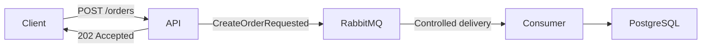

# 04 - Queue-Based Load Leveling

Queue-Based Load Leveling uses a queue to absorb peaks in incoming traffic and lets consumers process work at a controlled rate. This prevents a sudden increase in requests from becoming an equivalent load spike on downstream resources such as databases.

## Architecture



For simplicity, the HTTP API and RabbitMQ consumer run in the same Spring Boot application. The queue still decouples the request arrival rate from the order processing rate. In a production system, they could be deployed and scaled independently.

## Behavior

The API publishes an order request to RabbitMQ and immediately returns `202 Accepted` with a tracking ID. The consumer reads messages from the queue and persists orders asynchronously in PostgreSQL.

RabbitMQ is configured with a durable exchange, queue, dead-letter exchange, and dead-letter queue. PostgreSQL migrations are managed with Flyway.

## Test scenarios

The end-to-end tests use Testcontainers, RabbitMQ Management API, PostgreSQL JDBC, and Awaitility to demonstrate:

- concurrent requests are eventually persisted;
- requests accumulate in RabbitMQ while the consumer is stopped;
- the backlog is drained after the consumer restarts;
- `concurrency=1` and `prefetch=1` limit processing to one in-flight order;
- the API does not return `202 Accepted` while RabbitMQ is unavailable;
- queued messages are preserved and processed after PostgreSQL recovers.

The scenarios are organized in:

- [`OrdersQueueBasedLoadLevelingE2ETests`](./src/test/java/org/example/orders/OrdersQueueBasedLoadLevelingE2ETests.java);
- [`OrdersConsumerLoadLevelingE2ETests`](./src/test/java/org/example/orders/OrdersConsumerLoadLevelingE2ETests.java);
- [`OrdersPostgreSQLRecoveryE2ETests`](./src/test/java/org/example/orders/OrdersPostgreSQLRecoveryE2ETests.java).

## Dependencies

- Java 26;
- Spring Boot 4.1;
- RabbitMQ 4.3 with the Management plugin;
- PostgreSQL 18;
- Testcontainers and Docker;
- Awaitility.

## How to run

Docker must be running. From this subproject folder, execute:

```bash
./mvnw clean package
```

This command builds the application, starts isolated RabbitMQ and PostgreSQL containers, runs all end-to-end scenarios, and generates the executable JAR in `target/`.

To run only the tests:

```bash
./mvnw test
```
