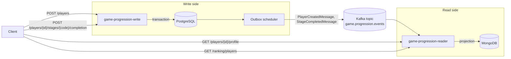

# 06 - CQRS

This project is a practical CQRS example for a game progression domain. It keeps command handling and query handling in separate applications, persists each side in a database shaped for its own needs, and connects both sides through domain events.

## Architecture



## Modules

- `game-progression-write`: command API. It owns business decisions and writes to PostgreSQL.
- `game-progression-reader`: query API. It consumes events and builds MongoDB projections.
- `game-progression-contracts`: event message contracts shared between write and reader.
- `integrated-tests`: black-box integration tests that validate APIs, PostgreSQL, MongoDB, and Kafka.
- `env`: local Docker Compose environment for manual development.

## CQRS practices demonstrated

- Separate write and read applications.
- Separate persistence models: PostgreSQL for the command model, MongoDB for the query model.
- Commands express intent: create a player and complete a stage.
- Queries read from projections: player profile and player ranking.
- Domain events integrate both sides asynchronously.
- Outbox pattern publishes events after write-side persistence.
- Reader-side idempotency avoids duplicating already processed events.
- Integration tests validate eventual consistency instead of assuming synchronous projection.

## Why separate write and read sides

The separation is useful because commands and queries usually have different needs.

On the write side, the project can focus on:

- enforcing business rules;
- protecting transactional consistency;
- modeling aggregates around behavior;
- storing normalized state in PostgreSQL;
- recording events reliably with the outbox pattern.

On the read side, the project can focus on:

- returning data in the shape required by clients;
- optimizing queries without affecting command logic;
- storing denormalized projections in MongoDB;
- creating read-specific views, such as profile and ranking;
- scaling query handling independently from command handling.

This avoids forcing one model to serve two different purposes. The write model stays expressive for business decisions, while the read model stays convenient and efficient for API responses.

## CQRS vocabulary in this project

| Concept | Where to look | Responsibility |
| --- | --- | --- |
| Command | `game-progression-write/src/main/java/.../application/command` | Represents an intention to change state, such as `CreatePlayerCommand` or `CompleteStageCommand`. |
| Command handler | `game-progression-write/src/main/java/.../application/handler` | Executes business use cases, loads/saves the write model, and records domain events, such as `CreatePlayerCommandHandler` and `CompleteStageCommandHandler`. |
| Write model | `game-progression-write/src/main/java/.../domain/model` | Owns business rules for player progression, experience, level, and completed stages. |
| Write repository | `game-progression-write/src/main/java/.../application/port/PlayersRepository` and `game-progression-write/src/main/java/.../infrastructure/repository` | Persists and loads the write model from PostgreSQL. |
| Domain event | `game-progression-write/src/main/java/.../domain/event` | Captures something that already happened in the write model, such as `PlayerCreated` or `StageCompleted`. |
| Integration event | `game-progression-contracts/src/main/java/org/example/gameprogression/contracts` | Message contract published through Kafka, such as `PlayerCreatedMessage` or `StageCompletedMessage`. |
| Outbox | `game-progression-write/src/main/java/.../infrastructure/repository/springdatajpa/model/OutboxEventEntity` | Stores integration events in PostgreSQL before asynchronous publication. |
| Event publisher | `game-progression-write/src/main/java/.../infrastructure/scheduler/OutboxEventsScheduler` | Publishes pending outbox events to Kafka with event metadata headers. |
| Event consumer | `game-progression-reader/src/main/java/.../infrastructure/messaging` | Reads Kafka records and dispatches them to projection processors. |
| Projection processor | `game-progression-reader/src/main/java/.../infrastructure/processor` | Applies consumed events to the MongoDB read model, such as `PlayerCreatedProjectionProcessor` and `StageCompletedProjectionProcessor`. |
| Read model | `game-progression-reader/src/main/java/.../infrastructure/repository/springdatamongo/model/PlayerProfileDocument` | Stores query-optimized data for profile and ranking endpoints. |
| Query handler | `game-progression-reader/src/main/java/.../application/query/handler` | Reads projections and returns query models for the reader API, such as `GetPlayerProfileQueryHandler` and `GetPlayersRankingQueryHandler`. |
| Idempotency register | `ProcessedEventDocument` and `ProcessedEventRegister` | Records already processed event IDs so repeated events do not duplicate projections. |

## Main flows

### Create player

1. `POST /players` is received by the write API.
2. The write model validates and persists the player in PostgreSQL.
3. A `PlayerCreatedMessage` is stored in the outbox table in the same transaction.
4. The outbox scheduler publishes the event to Kafka.
5. The reader consumes the event and creates a MongoDB player profile projection.

### Complete stage

1. `POST /players/{playerId}/stages/{stageCode}/completion` is received by the write API.
2. The write model validates the player and stage completion.
3. PostgreSQL stores the completed stage and updates player experience/level.
4. A `StageCompletedMessage` is stored in the outbox.
5. The outbox scheduler publishes the event to Kafka.
6. The reader updates the MongoDB profile and ranking projection.

## Running locally

Start the full local environment:

```bash
docker compose -f env/docker-compose.yml up -d --build
```

Useful ports:

- Write API: `http://localhost:8080`
- Reader API: `http://localhost:8081`
- PostgreSQL: `localhost:5432`
- MongoDB: `localhost:27017`
- Kafka: `localhost:29092`
- Kafka UI: `http://localhost:8085`

Stop the environment:

```bash
docker compose -f env/docker-compose.yml down
```

## Running integration tests

The integration tests can start their own Docker Compose environment with Testcontainers:

```bash
mvn -f integrated-tests/pom.xml test
```

The test environment uses:

- `docker-compose.integrated-tests.yml`
- Docker image builds for write and reader applications
- dynamic ports for HTTP, PostgreSQL, and MongoDB
- Kafka exposed at `localhost:29092`

The tests cover:

- happy path for player progression
- invalid nickname
- unknown player
- invalid XP
- duplicate stage completion
- projection idempotency
- ranking projection
- ranking limit

## Manual API examples

Create a player:

```bash
curl -i -X POST http://localhost:8080/players \
  -H 'Content-Type: application/json' \
  -d '{"nickname":"player"}'
```

Complete a stage:

```bash
curl -i -X POST http://localhost:8080/players/{playerId}/stages/stage-1/completion \
  -H 'Content-Type: application/json' \
  -d '{"xpGained":1250}'
```

Get the projected profile:

```bash
curl -i http://localhost:8081/players/{playerId}/profile
```

Get ranking:

```bash
curl -i 'http://localhost:8081/ranking/players?limit=10'
```

## Consistency model

This example intentionally uses eventual consistency between the write side and the read side.

When a command endpoint returns successfully, the project guarantees that:

- the command was validated by the write side;
- the write model was persisted in PostgreSQL;
- the integration event was stored in the outbox table in the same transaction.

At that exact moment, the MongoDB projection may still be stale. The read side only catches up after:

1. `OutboxEventsScheduler` publishes the pending outbox event to Kafka.
2. `KafkaGameProgressionEventsConsumer` consumes the Kafka record.
3. The projection processor updates `PlayerProfileDocument` in MongoDB.
4. The reader API starts returning the updated profile or ranking.

This means a client should not assume that a successful command is immediately visible through the query API. A short delay is expected and is part of the architecture.

The project handles this trade-off with:

- outbox persistence, so events are not lost if Kafka publication fails temporarily;
- retry metadata in the outbox, so failed publications can be attempted again;
- idempotent processing in the reader, so duplicated Kafka records do not duplicate projections;
- integration tests using `await()` when asserting reader API responses or MongoDB projections.

In the tests, immediate assertions are used for the write side, while polling assertions are used for the read side. This keeps the tests aligned with the real consistency guarantees of CQRS.
