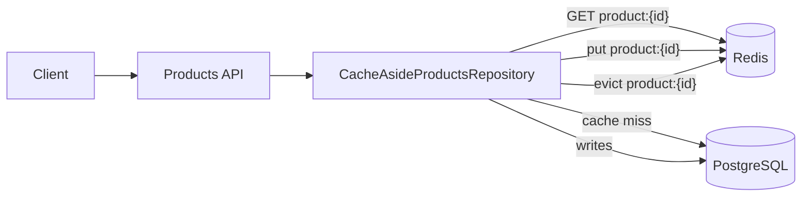

# 07 - Cache-Aside

Cache-Aside is a caching pattern where the application explicitly checks the cache before reading from the main database. On a cache miss, the application reads from the database and then stores the result in the cache for future requests.

This lab uses a products API with PostgreSQL as the source of truth and Redis as the cache.

## Architecture



## Design Choice

The cache is intentionally kept in the persistence adapter, not in the application use cases.

The application layer depends only on `ProductsRepository`. The implementation, `CacheAsideProductsRepository`, decides whether a read should come from Redis or PostgreSQL.

This keeps:

- domain model free from infrastructure concerns;
- use cases unaware of Redis;
- HTTP controllers focused on request/response handling;
- Cache-Aside behavior isolated in the infrastructure layer.

## Main Flow

For `GET /products/{id}`:

1. The repository checks Redis using the key `product:{id}`.
2. If the product exists in Redis, the cached value is returned.
3. If the key is missing or unreadable, PostgreSQL is queried.
4. If PostgreSQL has the product, Redis is populated with a 5 minute TTL.
5. If PostgreSQL does not have the product, the API returns `404` and no cache entry is created.

For `PUT /products/{id}`:

1. The product is loaded from the repository.
2. The updated product is saved in PostgreSQL.
3. The cached key is evicted so the next read reloads the current value.

## Test Scenarios

The integration tests are in [`CacheAsideIntegratedTests`](./src/test/java/org/example/cacheaside/CacheAsideIntegratedTests.java).

They cover:

- first product lookup populates Redis;
- cache hit returns the cached value even if PostgreSQL changes directly;
- product update evicts the cached value;
- unknown product does not create a cache entry;
- product creation does not populate Redis automatically;
- corrupted cache value falls back to PostgreSQL;
- cached product has expiration configured;
- only requested products are cached;
- updating a product that is not cached does not populate Redis;
- repeated lookups for an unknown product do not create negative cache;
- manually evicted cache is repopulated on the next lookup.

## Integration Test Environment

The test suite starts PostgreSQL and Redis through Docker Compose using `DockerComposeEnvironmentExtension`.

The Spring application receives its test database/cache configuration through `@DynamicPropertySource`.

The tests use:

- `PostgresExtension` to clean and inspect PostgreSQL;
- `RedisExtension` to clean and inspect Redis;
- the real HTTP API running on a random port.

## Running Locally

Start the local environment:

```bash
docker compose -f env/docker-compose.yml up -d
```

Run the application:

```bash
./mvnw spring-boot:run
```

Stop the environment:

```bash
docker compose -f env/docker-compose.yml down
```

## Running Tests

In this subproject folder, run:

```bash
./mvnw test
```

The tests start and stop the Docker Compose environment automatically.

To keep the containers running after the tests:

```bash
./mvnw test -Dintegration.environment.keep-running=true
```

## Manual API Examples

Create a product:

```bash
curl -i -X POST http://localhost:8080/products \
  -H 'Content-Type: application/json' \
  -d '{"name":"Mechanical Keyboard","price":249.90}'
```

Get a product:

```bash
curl -i http://localhost:8080/products/{productId}
```

Update a product price:

```bash
curl -i -X PUT http://localhost:8080/products/{productId} \
  -H 'Content-Type: application/json' \
  -d '{"price":299.90}'
```
